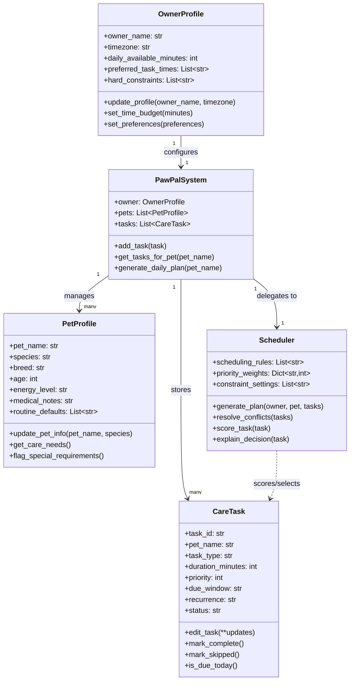

# PawPal+ (Module 2 Project)

You are building **PawPal+**, a Streamlit app that helps a pet owner plan care tasks for their pet.

## Scenario

A busy pet owner needs help staying consistent with pet care. They want an assistant that can:

- Track pet care tasks (walks, feeding, meds, enrichment, grooming, etc.)
- Consider constraints (time available, priority, owner preferences)
- Produce a daily plan and explain why it chose that plan

Your job is to design the system first (UML), then implement the logic in Python, then connect it to the Streamlit UI.

## What you will build

Your final app should:

- Let a user enter basic owner + pet info
- Let a user add/edit tasks (duration + priority at minimum)
- Generate a daily schedule/plan based on constraints and priorities
- Display the plan clearly (and ideally explain the reasoning)
- Include tests for the most important scheduling behaviors

## System architecture (UML)



## Smarter Scheduling

Phase 3 added four algorithmic improvements to `pawpal_system.py`:

**Sort by time** — `Scheduler.sort_by_time(tasks)` uses `sorted()` with a lambda key on each task's `scheduled_time` (`HH:MM` string). Tasks without a time sort to the end via the sentinel `"99:99"`. The final plan is always returned in chronological order.

**Filter by status and pet** — `PawPalSystem.filter_tasks(status, pet_name)` accepts either or both filters and returns the matching subset. This lets the UI or CLI quickly ask "what is still pending for Mochi?" without iterating manually.

**Recurring task support** — `CareTask` gained a `scheduled_weekday` field (0 = Monday … 6 = Sunday). `is_due_today(weekday)` now correctly handles `"weekly"` recurrence — a weekly task only appears in the plan on its scheduled day of the week.

**Conflict detection** — `Scheduler.detect_time_conflicts(tasks)` scans all tasks for shared `HH:MM` start times and returns human-readable warning strings instead of raising an exception. It catches same-pet and cross-pet overlaps. Note: it matches exact start times only, not overlapping durations — a deliberate tradeoff for simplicity (see `reflection.md` §2b).

## CLI-first workflow

Run the backend demo before using the UI:

```bash
python demo_cli.py
```

This prints a generated daily plan and explains why each task was selected.

## Testing PawPal+

Run the full test suite with:

```bash
python -m pytest
```

Or for a detailed per-test breakdown:

```bash
python -m pytest -v
```

### What the tests cover

| Area | Tests |
|---|---|
| **Sorting** | Tasks added out of order return in `HH:MM` ascending order; untimed tasks always sort last |
| **Recurrence** | Completed daily tasks are excluded from today's plan; `reset_for_new_day()` restores them to pending so they re-enter tomorrow's plan; weekly tasks appear only on their scheduled weekday and never when `weekday=None` |
| **Conflict detection** | Two tasks sharing a start time produce a warning string; distinct times produce none; tasks with no time set are ignored; empty input never raises |
| **Filtering** | `filter_tasks()` narrows by status, by pet name, and by both combined |
| **Core scheduling** | Time budget is respected; conflict resolution keeps the highest-priority duplicate; unknown pets are rejected; decision explanations are generated |
| **Edge cases** | Pet with zero tasks returns an empty plan; all-untimed sort returns the correct count |

21 tests — 21 passing.

### Confidence level

★★★★☆ (4 / 5)

The core scheduling behaviors (budget enforcement, conflict resolution, recurrence, sorting, filtering) are all covered by deterministic tests and pass consistently. One star is withheld because duration-overlap conflicts, calendar-aware weekly recurrence across month boundaries, and hard-constraint enforcement are not yet tested — known gaps documented in `reflection.md`.

## Streamlit app

Launch the app with:

```bash
streamlit run app.py
```

In the UI, add owner/pet data and tasks, then click **Generate schedule** to run the same backend scheduler used in CLI and tests.

## Getting started

### Setup

```bash
python -m venv .venv
source .venv/bin/activate  # Windows: .venv\Scripts\activate
pip install -r requirements.txt
```

### Suggested workflow

1. Read the scenario carefully and identify requirements and edge cases.
2. Draft a UML diagram (classes, attributes, methods, relationships).
3. Convert UML into Python class stubs (no logic yet).
4. Implement scheduling logic in small increments.
5. Add tests to verify key behaviors.
6. Connect your logic to the Streamlit UI in `app.py`.
7. Refine UML so it matches what you actually built.
