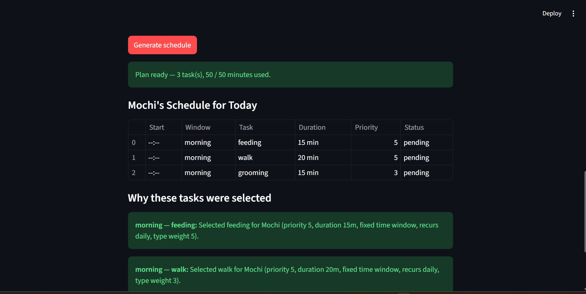
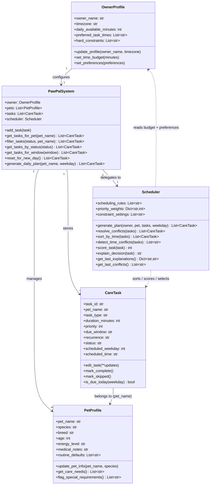

# PawPal+ (Module 2 Project)

**PawPal+** is a Python-powered pet care scheduling assistant with a Streamlit UI. It takes a pet owner's time constraints, task priorities, and pet profile, then produces a sorted, conflict-checked daily plan — and explains every decision it makes.

## 📸 Demo

<a href="pawpal_screenshot.png" target="_blank"></a>

## Features

### Core scheduling
- **Priority-based task selection** — tasks are scored by priority (1–5), task-type weights (e.g. medication scores higher than grooming), and time-window specificity. Higher-scoring tasks are selected first.
- **Daily time budget enforcement** — the scheduler fills the owner's available minutes greedily, stopping before the budget is exceeded. Tasks that don't fit are surfaced as "not scheduled" with an explanation.
- **Owner preference bonus** — tasks whose due window matches the owner's preferred times receive a score boost, so morning people get morning-first plans.

### Sorting
- **Sort by time (`sort_by_time`)** — the final plan is always displayed in `HH:MM` chronological order using `sorted()` with a lambda key. Tasks without a start time sort to the end via a `"99:99"` sentinel, so they never jump ahead of timed tasks.

### Conflict detection
- **Exact-time conflict warnings (`detect_time_conflicts`)** — scans all tasks for shared `HH:MM` start times across any pet and returns plain-English warning strings without crashing. Shown as `st.warning` banners in the UI so the owner sees them immediately above the schedule.
- **Cross-window duplicate detection (`resolve_conflicts`)** — if the same task type appears in multiple time windows for one pet (e.g. "feeding" at morning and evening), the scheduler keeps the highest-priority version and warns about the rest.

### Recurrence
- **Daily recurrence** — daily tasks are included in every plan while their status is `pending`. Marking one `complete` removes it from the same day; `reset_for_new_day()` restores all completed daily tasks to `pending` for the next day.
- **Weekly recurrence** — tasks can be pinned to a specific weekday (0 = Monday … 6 = Sunday). A Saturday grooming task only appears in Saturday's plan; it is invisible every other day.

### Filtering & querying
- **Filter by status and pet (`filter_tasks`)** — returns any combination of status (`pending` / `complete` / `skipped`) and pet name, making it easy to ask "what still needs to be done for Mochi today?"
- **Window snapshot (`get_tasks_for_window`)** — returns all pending tasks scheduled for a given time window across all pets.

### Explainability
- **Decision explanations** — every selected task gets a plain-English reason: priority score, duration, time window type, recurrence, and type weight. Displayed as `st.success` cards in the UI.
- **Tasks left out** — tasks excluded by the budget are listed separately with a reason, so nothing silently disappears.

---

## Scenario

A busy pet owner needs help staying consistent with pet care. They want an assistant that can:

- Track pet care tasks (walks, feeding, meds, enrichment, grooming, etc.)
- Consider constraints (time available, priority, owner preferences)
- Produce a daily plan and explain why it chose that plan

Your job is to design the system first (UML), then implement the logic in Python, then connect it to the Streamlit UI.

## What you will build

Your final app should:

- Let a user enter basic owner + pet info
- Let a user add/edit tasks (duration + priority at minimum)
- Generate a daily schedule/plan based on constraints and priorities
- Display the plan clearly (and ideally explain the reasoning)
- Include tests for the most important scheduling behaviors

## System architecture (UML)



## Smarter Scheduling

Phase 3 added five algorithmic improvements to `pawpal_system.py`:

**Sort by time** — `Scheduler.sort_by_time(tasks)` uses `sorted()` with a lambda key on each task's `scheduled_time` (`HH:MM` string). Tasks without a time sort to the end via the sentinel `"99:99"`. The final plan is always returned in chronological order.

**Filter by status and pet** — `PawPalSystem.filter_tasks(status, pet_name)` accepts either or both filters and returns the matching subset. This lets the UI or CLI quickly ask "what is still pending for Mochi?" without iterating manually.

**Recurring task support** — `CareTask` gained a `scheduled_weekday` field (0 = Monday … 6 = Sunday). `is_due_today(weekday)` now correctly handles `"weekly"` recurrence — a weekly task only appears in the plan on its scheduled day of the week.

**Conflict detection** — `Scheduler.detect_time_conflicts(tasks)` scans all tasks for shared `HH:MM` start times and returns human-readable warning strings instead of raising an exception. It catches same-pet and cross-pet overlaps. Note: it matches exact start times only, not overlapping durations — a deliberate tradeoff for simplicity (see `reflection.md` §2b).

**Next available slot assignment** — `Scheduler.assign_next_available_slots(tasks)` auto-assigns `scheduled_time` for tasks without one. It places each untimed task into the earliest non-overlapping interval inside its due window (`morning`, `afternoon`, `evening`, `anytime`) and falls back to the broader `anytime` range if a specific window is full.

## CLI-first workflow

Run the backend demo before using the UI:

```bash
python demo_cli.py
```

This prints a generated daily plan and explains why each task was selected.

## Testing PawPal+

Run the full test suite with:

```bash
python -m pytest
```

Or for a detailed per-test breakdown:

```bash
python -m pytest -v
```

### What the tests cover

| Area | Tests |
|---|---|
| **Sorting** | Tasks added out of order return in `HH:MM` ascending order; untimed tasks always sort last |
| **Recurrence** | Completed daily tasks are excluded from today's plan; `reset_for_new_day()` restores them to pending so they re-enter tomorrow's plan; weekly tasks appear only on their scheduled weekday and never when `weekday=None` |
| **Conflict detection** | Two tasks sharing a start time produce a warning string; distinct times produce none; tasks with no time set are ignored; empty input never raises |
| **Filtering** | `filter_tasks()` narrows by status, by pet name, and by both combined |
| **Core scheduling** | Time budget is respected; conflict resolution keeps the highest-priority duplicate; unknown pets are rejected; decision explanations are generated |
| **Edge cases** | Pet with zero tasks returns an empty plan; all-untimed sort returns the correct count |

21 tests — 21 passing.

### Confidence level

★★★★☆ (4 / 5)

The core scheduling behaviors (budget enforcement, conflict resolution, recurrence, sorting, filtering) are all covered by deterministic tests and pass consistently. One star is withheld because duration-overlap conflicts, calendar-aware weekly recurrence across month boundaries, and hard-constraint enforcement are not yet tested — known gaps documented in `reflection.md`.

## Streamlit app

Launch the app with:

```bash
streamlit run app.py
```

In the UI, add owner/pet data and tasks, then click **Generate schedule** to run the same backend scheduler used in CLI and tests.

## Getting started

### Setup

```bash
python -m venv .venv
source .venv/bin/activate  # Windows: .venv\Scripts\activate
pip install -r requirements.txt
```

### Suggested workflow

1. Read the scenario carefully and identify requirements and edge cases.
2. Draft a UML diagram (classes, attributes, methods, relationships).
3. Convert UML into Python class stubs (no logic yet).
4. Implement scheduling logic in small increments.
5. Add tests to verify key behaviors.
6. Connect your logic to the Streamlit UI in `app.py`.
7. Refine UML so it matches what you actually built.

## Agent Mode usage

Agent Mode was used as a coding collaborator to implement the new scheduling logic in small, verifiable steps:

1. Reviewed `Scheduler.generate_plan()` plus existing tests to identify where slot assignment should run.
2. Implemented `assign_next_available_slots()` with helper logic to convert `HH:MM` times, scan occupied intervals, and find the earliest valid gap.
3. Integrated the slot assignment step before final chronological sorting so generated plans show concrete start times.
4. Added targeted tests covering untimed-task slot assignment and gap-aware placement when a timed task already exists.
5. Re-ran pytest to confirm the new capability passed and existing behavior remained stable.
